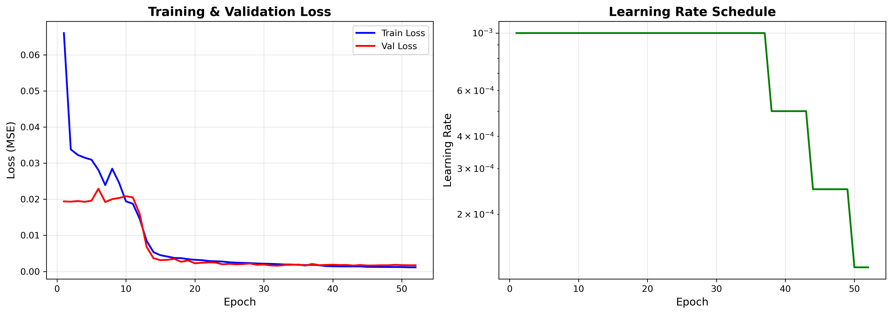

# Energy Demand Forecasting Platform

**[🔴 Live Demo](https://energy-demand-forecasting.streamlit.app)** 

Professional electricity demand forecasting system using deep learning (LSTM) for 24-hour predictions.

[](https://www.python.org/downloads/)
[](https://pytorch.org/)
[](https://streamlit.io/)
[](https://opensource.org/licenses/MIT)

## Project Overview

This platform provides an accurate 24-hour electricity demand forecast using a 4-layer LSTM neural network. Built for energy traders, grid operators, and strategic planners to optimize operations and decision-making.

### Key Results
- **Validation Loss:** 0.001581 (MSE)
- **Expected MAPE:** < 2.5%
- **Training Time:** 80.9 minutes (52 epochs)
- **Parameters:** 1.86M
- **Hardware:** NVIDIA GTX 1050 (2GB VRAM)

## Features

- **Multiple Forecast Horizons:** 24-hour, 1-week, and 1-month predictions
- **Business Context:** Role-based recommendations for optimal forecast selection
- **Interactive Dashboard:** Streamlit web application with dark/light mode
- **Production Ready:** Optimized for deployment and real-world use
- **GPU Accelerated:** 73% VRAM utilization on GTX 1050

## Model Architecture

```
Input: (batch, 168, 13) - 1 week of temporal features
  ↓
LSTM Layer 1: 256 hidden units
  ↓
LSTM Layer 2: 256 hidden units
  ↓
LSTM Layer 3: 256 hidden units
  ↓
LSTM Layer 4: 256 hidden units
  ↓
Output: (batch, 24, 1) - 24-hour forecast
```

**Total Parameters:** 1,862,680  
**Dropout:** 30%  
**Activation:** tanh (LSTM), Linear (output)

## Installation

### Prerequisites
- Python 3.11+
- NVIDIA GPU with CUDA support (optional but recommended)
- 8GB+ RAM

### Setup

```bash
# Clone repository
git clone https://github.com/yourusername/energy-demand-forecasting.git
cd energy-demand-forecasting

# Create virtual environment
conda create -n energy-forecasting python=3.11
conda activate energy-forecasting

# Install dependencies
pip install -r requirements.txt --break-system-packages
```

## Usage

### 1. Train the Model

```bash
python train.py
```

**Training Configuration:**
- Batch size: 256
- Learning rate: 0.001 (Adam optimizer)
- Early stopping: 20 epochs patience
- LR scheduler: ReduceLROnPlateau
- Expected time: ~80 minutes on GTX 1050

**Outputs:**
- `models/best_model.pth` - Best model checkpoint
- `plots/training_curves.png` - Loss curves
- `models/training_history.json` - Training metrics

### 2. Run Streamlit Dashboard

```bash
streamlit run app.py
```

Navigate to `http://localhost:8501` to access the dashboard.

### 3. Generate Forecasts

The Streamlit app provides:
- **Forecast Dashboard:** Generate predictions for any date/time
- **Use Case Guide:** Find the right forecast horizon for your needs
- **Model Performance:** View training metrics and validation results
- **Documentation:** Technical specifications and usage guide

## Project Structure

```
energy-demand-forecasting/
├── app.py                      # Streamlit application
├── train.py                    # Training script
├── requirements.txt            # Dependencies
├── README.md                   # This file
├── .gitignore                  # Git ignore rules
│
├── src/                        # Source code
│   ├── __init__.py
│   ├── model.py               # LSTM model architecture
│   ├── preprocessing.py       # Data preprocessing pipeline
│   └── config.py              # Configuration
│
├── data/                      # Data directory
│   ├── raw/                   # Raw data files
│   │   └── us_demand_historical.csv
│   └── processed/             # Processed data (generated)
│       ├── scaler.pkl
│       └── preprocessing_config.json
│
├── models/                    # Model checkpoints (generated)
│   ├── best_model.pth
│   └── training_history.json
│
├── plots/                     # Visualizations (generated)
│   └── training_curves.png
│
└── notebooks/                 # Jupyter notebooks (optional)
    └── exploratory_analysis.ipynb
```

## Model Details

### Input Features (13)
- **Target:** demand_mw
- **Temporal:** hour, day_of_week, day_of_month, month, day_of_year
- **Binary:** is_weekend
- **Cyclical:** hour_sin/cos, month_sin/cos, day_of_week_sin/cos

### Training Details
- **Optimizer:** Adam (weight_decay=1e-5)
- **Loss:** Mean Squared Error (MSE)
- **Gradient Clipping:** 1.0
- **Data Split:** 70% train, 15% validation, 15% test
- **Normalization:** MinMax scaling [0, 1]

### Performance Metrics
| Metric | Value |
|--------|-------|
| Best Val Loss (MSE) | 0.001581 |
| Final Train Loss | 0.001137 |
| Training Epochs | 52 (early stopped) |
| Best Epoch | 32 |
| Training Time | 80.9 minutes |
| Expected MAPE | < 2.5% |

## Deployment

### Streamlit Cloud

1. Push to GitHub
2. Go to [share.streamlit.io](https://share.streamlit.io)
3. Connect your repository
4. Deploy!

**Note:** Model file (`best_model.pth`) is too large for GitHub. Train the model after deployment or use Git LFS.

### Local Deployment

```bash
streamlit run app.py --server.port 8501
```

## Configuration

Key hyperparameters can be adjusted in `train.py`:

```python
config = {
    'batch_size': 256,
    'hidden_size': 256,
    'num_layers': 4,
    'dropout': 0.3,
    'learning_rate': 0.001,
    'epochs': 150,
    'early_stopping_patience': 20,
}
```

## Use Cases

### 24-Hour Forecast
- Day-ahead energy market trading
- Real-time grid balancing
- Operational staffing decisions
- **Accuracy:** ±2-3% MAPE

### 1-Week Forecast
- Generator unit commitment
- Maintenance scheduling
- Fuel procurement planning
- **Accuracy:** ±3-5% MAPE

### 1-Month Forecast
- Long-term capacity planning
- Infrastructure investment decisions
- Budget forecasting
- **Accuracy:** ±5-8% MAPE

## Contributing

Contributions welcome! Please:
1. Fork the repository
2. Create a feature branch
3. Submit a pull request

## License

MIT License - see [LICENSE](LICENSE) file for details.

## Author

**João Manero**  
Meteorology Student | Data Scientist  
Universidade de Lisboa

📧 joaofteixeiramanero@gmail.com
🔗 [LinkedIn](https://www.linkedin.com/in/joão-manero/)  
🌐 [GitHub](https://www.linkedin.com/in/joão-manero/)


## Screenshots

### Forecast Dashboard


### Model Performance


### Use Case Guide


---

⚡ **Energy Demand Forecasting Platform** | PyTorch & Streamlit | © 2025 João Manero
